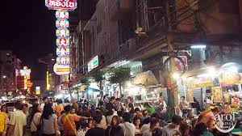

+++
title = "Landscapes in Old Bangkok and China Town"
weight = 99
date = 2023-02-15
+++

# Rattanakosin side:

The Grand Palace and the Temple of the Emerald Buddha are two major landmarks in the first settled area of the Rattanakosin Era. The Grand Palace was the residence of the Thai King for 150 years and is a stunning display of traditional Thai architecture and craftsmanship. The Temple of the Emerald Buddha, located within the Grand Palace complex, houses a highly revered statue of the Buddha carved from a single block of jade. Chinese stone dolls can also be found around the temple.
Sanam Luang, or the Royal Field, is a public park that was used in the past for various royal ceremonies and political gatherings.
Wat Phra Chetuphon, also known as Wat Pho, is one of the largest and oldest temples in Bangkok. It is famous for its giant reclining Buddha statue and traditional Thai massage school.
The Giant Swing and Wat Sutat are two religious landmarks that are part of a Brahmin ceremony performed every year. The Giant Swing, a tall wooden structure, was used in the past as a rite of passage for young men to prove their bravery.

The Giant Swing ceremony was a Brahmin ritual that was performed in front of the Giant Swing, a tall wooden structure located in the Rattanakosin area of Bangkok. The ceremony was performed to ask for blessings from the gods and was considered a rite of passage for young men to prove their bravery. The ritual involved a group of young men climbing up the Giant Swing and then swinging back and forth in the air while attempting to grab a bag of gold coins with their teeth.
The ceremony was discontinued in 1932 when Thailand transitioned to a constitutional monarchy, and the Giant Swing was later moved to its current location near Wat Sutat. Today, the ceremony is no longer performed, but the Giant Swing remains a popular tourist attraction and cultural landmark in Bangkok. Visitors can learn more about the history and significance of the ceremony by visiting the nearby Wat Sutat temple, which houses a shrine dedicated to the Giant Swing.

-   The Democracy Monument is a political symbol of Thailand's transition to democracy in 1932. It features a central column surrounded by four wings, representing the branches of the Thai government.
-   The Metal Castle at Wat Rachanadda is a unique structure made entirely of metal and is one of only a few in the world.
-   The Golden Mount at Wat Saket is a Buddhist temple featuring a large golden chedi, or pagoda, on top of a man-made hill.
-   The Rattanakosin side in Bangkok is known for its rich cultural and historical heritage. One of the major landmarks in this area is the Grand Palace, which served as the residence of the Kings of Siam and Thailand. The palace is renowned for its intricate and elaborate architecture, and visitors can also find Chinese stone dolls around the temple. Another significant landmark in Rattanakosin is the Temple of the Emerald Buddha, which is considered one of the holiest Buddhist temples in Thailand.
-   Sanam Luang is a royal field that has been used for various cultural and religious ceremonies in the past. Wat Phra Chetuphon, also known as Wat Pho, is another important temple in the area that is famous for its large Reclining Buddha statue and traditional Thai massage.
-   The Giant Swing and Wat Sutat is a religious site where the Swing ceremony was once performed to ask for blessings from the gods. The Democracy Monument is a political symbol that represents the country's fight for democracy and freedom. The Metal Castle at Wat Rachanadda is a unique architectural structure and is one of the few metal castles in the world. The Golden Mount at Wat Saket is another popular landmark that offers stunning views of the city from its height.

# Thonburi side:

Thonburi Palace, also known as Wang Derm, was the former royal palace of the Thonburi Kingdom and is now a museum showcasing the history of Thailand's former capital.
Wat Arun, or the Temple of Dawn, is a stunning temple featuring towering Khmer-style prangs decorated with colorful glass and Chinese porcelain.
On the Thonburi side, the Thonburi Palace or Wang Derm was once the residence of King Taksin and is now a museum that showcases the history of the Thonburi period. Wat Arun, also known as the Temple of Dawn, is another famous landmark that is known for its Khmer-style architecture and its intricate stupa made of colorful glass and Chinese porcelain.
Main River of BKK:

-   The Chao Praya river is an important cultural and economic center for Thais and is considered the lifeblood of Bangkok. It is used for transportation, irrigation, and as a source of fish for the local population. The river is also an important religious site, with many temples and shrines located along its banks.
-   The Chao Praya River is the main river of Bangkok and holds great significance to the Thai people. It is not only a source of water for the city but is also considered as a spiritual center and has been a key aspect of Thai history and culture.

# Chinatown

Chinatown in Bangkok, also known as Yaowarat, is a vibrant district that reflects the unique culture and traditions of Chinese immigrants who have lived in Thailand for centuries. The district is famous for its bustling markets, street food, traditional architecture, and cultural landmarks. One of the most famous landmarks in Chinatown is the Wat Mangkon Kamalawat, a large temple that is renowned for its Chinese-style architecture and vibrant decorations. The temple is a popular attraction among both locals and tourists, who come to pay their respects to the Buddha and enjoy the tranquil atmosphere of the temple.
Another famous landmark in Chinatown is the Odeon Circle, a historic monument that dates back to the early 20th century. The circle is located at the entrance of Chinatown and features a large archway that is decorated with intricate Chinese designs. It is a popular spot for taking photos and has become an iconic symbol of Chinatown in Bangkok.
One of the most unique features of Chinatown is its street food culture. The district is home to numerous food stalls and restaurants that offer a variety of Chinese and Thai dishes. From delicious seafood to traditional dim sum, visitors to Chinatown can experience the rich and diverse flavors of Chinese and Thai cuisine. Overall, Chinatown in Bangkok is a must-visit destination for anyone interested in experiencing the rich cultural heritage of Chinese immigrants in Thailand.

In addition to its cultural and culinary attractions, Chinatown in Bangkok is also home to many traditional shops and markets. Visitors can find a wide range of goods, from Chinese herbs and medicines to gold jewelry and antiques. One of the most popular markets in Chinatown is the Sampeng Market, a bustling street market that offers a diverse range of products at affordable prices. It is a great place to shop for souvenirs and gifts or to simply soak up the vibrant atmosphere of Chinatown.
Finally, Chinatown in Bangkok also has a rich history and heritage. Chinese immigrants have been settling in Thailand for centuries, and their influence can be seen in the architecture, cuisine, and culture of Chinatown. The district has played an important role in the development of Bangkok and Thailand as a whole, and its heritage is an important part of the country's history. Visitors to Chinatown can learn about the district's history and culture through various museums and exhibitions, such as the Museum of Siam and the Bangkokian Museum.
Overall, Chinatown in Bangkok is a fascinating and unique destination that offers a rich cultural experience for visitors. From its traditional architecture and cultural landmarks to its vibrant markets and street food culture, Chinatown is a must-visit destination for anyone interested in exploring the diverse and colorful heritage of Thailand.

# Summary:

The city of Bangkok is home to numerous landmarks and historic sites that are of great cultural significance to the Thai people. The Rattanakosin side of the city is particularly rich in history and cultural landmarks, including the Grand Palace and the Temple of the Emerald Buddha, which are considered two of the most important landmarks in the first settled area of the Rattanakosin Era. The Grand Palace, which was the residence of the Thai King for 150 years, is a stunning display of traditional Thai architecture and craftsmanship, while the Temple of the Emerald Buddha houses a highly revered statue of the Buddha carved from a single block of jade.
Another important landmark on the Rattanakosin side is Sanam Luang, or the Royal Field, a public park that was used in the past for various royal ceremonies and political gatherings. Wat Phra Chetuphon, also known as Wat Pho, is one of the largest and oldest temples in Bangkok and is famous for its giant reclining Buddha statue and traditional Thai massage school.
The Giant Swing and Wat Sutat are two religious landmarks that are part of a Brahmin ceremony performed every year. The Giant Swing, a tall wooden structure, was used in the past as a rite of passage for young men to prove their bravery. The Democracy Monument is a political symbol of Thailand's transition to democracy in 1932 and features a central column surrounded by four wings, representing the branches of the Thai government.
The Metal Castle at Wat Rachanadda is a unique structure made entirely of metal and is one of only a few in the world, while the Golden Mount at Wat Saket is a Buddhist temple featuring a large golden chedi, or pagoda, on top of a man-made hill.
On the Thonburi side of the city, the Thonburi Palace, also known as Wang Derm, was the former royal palace of the Thonburi Kingdom and is now a museum showcasing the history of Thailand's former capital. Wat Arun, or the Temple of Dawn, is a stunning temple featuring towering Khmer-style prangs decorated with colorful glass and Chinese porcelain.
The Chao Praya river, which runs through the city, is an important cultural and economic center for Thais and is considered the lifeblood of Bangkok. It is used for transportation, irrigation, and as a source of fish for the local population. The river is also an important religious site, with many temples and shrines located along its banks.
